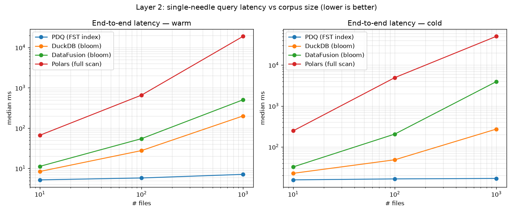

# PDQ Benchmarks — FST Side Index vs. Parquet Bloom Filters

A head-to-head between PDQ's per-column **FST side index** and **Parquet-native bloom
filters** on the workload PDQ targets: finding rare cybersecurity indicators (IPs, hashes,
domains, emails) across many Parquet log files — a selective needle-in-a-haystack search.

**Headline:** PDQ's per-query latency is **flat** as the corpus grows, because it consults
the index, opens only the matched file, and (via row-filter pushdown) decodes only the
matching row. The query engines scale linearly with file count. PDQ's pruning is also
**exact** — zero false positives — where a bloom filter returns a probabilistic candidate set.
Because it's exact, the index answer is **authoritative on its own**: a single lookup confirms
an indicator is present (with the exact files and row groups) or absent from the entire corpus,
no file reads required — a presence/absence oracle for threat hunting, not just a scan
accelerator. All of this holds against **tuned** engines running a **matched query shape**:
turning on DuckDB's metadata cache moves its n=1000 warm latency only −12%, confirming the gap
is structural (PDQ is O(matches), the engines are O(files)) rather than a footer-parsing
artifact.

Run on a dedicated AWS `i4i.xlarge` (4 vCPU, 32 GiB, local NVMe, Ubuntu 24.04), commit
`dabf5e6`, full n = 10 / 100 / 1000 ladder, warm + cold. Absolute latencies are
machine-dependent; byte and footprint counts are exact.

---

## Setup

|                                         |                                                                                                                                                                                                  |
| --------------------------------------- | ------------------------------------------------------------------------------------------------------------------------------------------------------------------------------------------------ |
| **Host**                                | AWS EC2 `i4i.xlarge` — 4 vCPU, 32 GiB, local NVMe, Ubuntu 24.04                                                                                                                                  |
| **PDQ / Rust DataFusion**               | DataFusion 54.0.0 (`default-features = false`); provider uses cached `ParquetMetaData` + `with_pushdown_filters(true)` + footer size hint; measured in-process via its Python binding            |
| **Engine contestants**                  | DuckDB **1.5.4**, DataFusion (Python) **53.0.0**, Polars **1.36.1**, PyArrow **22.0.0**, stamped into every results row. The Python DataFusion is independent of the Rust 54.0.0 pin inside PDQ. |
| **Engine tuning (standard knobs only)** | DuckDB: `parquet_metadata_cache=true` (`enable_external_file_cache` on by default). DataFusion: `pushdown_filters` + `reorder_filters` + `bloom_filter_on_read`. No custom reader factories.     |
| **Query shape**                         | Matched: every contestant runs `SELECT *` and materializes the matching row(s) — the same unit of work as PDQ.                                                                                   |
| **Threads**                             | all engines pinned to the same width (`SHOOTOUT_THREADS`, default ncpu = 4)                                                                                                                      |

### Corpus

A deterministic ladder of **10 / 100 / 1000** Parquet files. Each file is 8 row groups ×
100,000 rows (800k rows), 5 columns (`src_ip`, `dst_ip`, `domain_rev`, `email`, `bytes`),
with per-column bloom filters on the 4 indexed columns and dictionary encoding on. At n=10
the corpus is 540 MB; at n=1000 it is ~54 GB / 800M rows / 8,000 row groups. PDQ FST indexes
cover the same 4 columns.

Needles (`manifest.json`): the **single needle** `192.168.133.7` sits in one row group of one
file (1 of 8,000 at n=1000) — the selective case. The **multi-IOC** sweep `10.<hi>.<lo>.7`
plants one unique value in row group 0 of every file — an N-indicator watchlist.

Two layers are measured. **Layer 1** is the pruning decision alone (which row groups match,
no row reads). **Layer 2** is the full end-to-end query returning the matching row, validated
against a brute-force Polars oracle.

---

## Layer 2 — end-to-end query

Full query returning the matching row, all contestants running a matched `SELECT *`. Median
ms; warm = 30 runs, cold = 5 runs with the OS page cache dropped before each sample.



### Warm (long-lived, tuned engines, hot cache)

| n_files |      pdq | duckdb | datafusion |   polars |
| ------: | -------: | -----: | ---------: | -------: |
|      10 | **5.20** |   8.41 |      11.27 |    66.63 |
|     100 | **5.80** |  27.74 |      54.82 |   659.47 |
|    1000 | **7.12** | 200.84 |     505.63 | 18997.64 |

PDQ is flat across a 100× corpus growth (5.2 → 7.1 ms); the engines scale with file count
because each query visits every file's row-group metadata and probes its blooms. At n=1000
PDQ is 28× faster than DuckDB and 71× faster than DataFusion.

> **Tuning the engines barely moves them — the gap is structural.** DuckDB runs with its
> metadata cache on, yet that moves its n=1000 warm only 227 → 201 ms (−12%): the dominant
> warm cost isn't footer _parsing_, it's visiting all N files' metadata and probing N blooms
> per query, which is O(files) however it's cached, while PDQ is O(matches). One residual
> handicap: DataFusion 53's Python API exposes no standard cross-query metadata cache, so its
> warm number still re-parses footers — but since the same knob barely helped DuckDB, this is
> unlikely to change the ranking. (Polars n=1000 is a full scan, IQR ~13.5–28 s.)

### Cold (OS page cache dropped before every sample)

| n_files |       pdq | duckdb | datafusion |   polars |
| ------: | --------: | -----: | ---------: | -------: |
|      10 | **15.62** |  22.57 |      32.39 |   246.95 |
|     100 | **16.48** |  48.36 |     205.67 |  4939.13 |
|    1000 | **16.91** | 272.57 |    3952.82 | 50532.09 |

Cold latency is likewise flat (~15–17 ms). At n=1000 PDQ is 16× faster than DuckDB and 234×
faster than DataFusion.

> **What "cold" means here.** Dropping the OS page cache cannot evict an engine's _in-process_
> caches, which persist across samples. PDQ's mmap'd data is genuinely re-faulted each sample
> while its parsed metadata stays cached; DuckDB keeps both its metadata cache and its
> file-byte cache (on by default), so its cold is only partly cold (n=1000 cold 273 ms is
> barely above its warm 201 ms); DataFusion and Polars are genuinely cold. That makes PDQ vs
> DuckDB the cache-symmetric comparison — both keep parsed metadata in-process, and the
> asymmetry that remains (DuckDB's file-byte cache) _flatters_ DuckDB — so **16× is the cold
> headline**. Against DataFusion and Polars the asymmetry runs the other way: they re-parse
> every footer each sample while PDQ's parsed metadata persists, so the 234× is an **upper
> bound**. That reflects a real product difference (DataFusion's Python API exposes no
> cross-query metadata cache), not a like-for-like cache multiple.

---

## Layer 1 — pruning cost

Time to decide which row groups match, no row data read. Warm, median of 20. Both sides
amortize the per-file index open across a watchlist — the apples-to-apples comparison.


| n_files |  PDQ FST |     Bloom | PDQ faster |
| ------: | -------: | --------: | ---------: |
|      10 | 0.040 ms |  14.32 ms |   **358×** |
|     100 |  2.54 ms |  154.6 ms |    **61×** |
|    1000 | 254.5 ms | 1673.9 ms |   **6.6×** |

The win is structural: an mmap'd FST traversal is an O(key-length) automaton walk, while the
bloom path's dominant cost is opening and footer-parsing every file. The gap narrows at
n=1000 because the bloom footer-parse amortizes perfectly across the watchlist while PDQ pays
a per-term walk that amortizes less completely — PDQ still wins, exactly, at every scale.

> A single-indicator variant of this bench shows ~800–2800×, but that figure is
> amortization-asymmetric (a resident FST handle vs. a bloom path re-opened every iteration)
> and shouldn't be quoted as the true multiple. The table above, with both sides amortized,
> is the honest pruning comparison. One residual asymmetry remains even here: the FST handle
> stays resident _across_ queries (a side index is designed to live in a long-lived service),
> while the bloom path re-opens and footer-parses every file _per_ query — an engine that
> caches parsed footers across queries would amortize that too. Layer 2 bounds how much that
> is worth: turning on exactly that cache in DuckDB moved its n=1000 warm end-to-end only
> −12%, so cross-query footer caching shrinks the bloom column but does not close the gap.
> Byte/footprint columns are omitted: FST _footprint_
> (whole-file on-disk size) and bloom _bytes-read_ (exact faults) measure different things and
> aren't comparable; the time column is the per-query story.

---

## Correctness — PDQ is exact, bloom is not

Single needle, truth: present in exactly 1 file.

| n_files | PDQ (exact) | Bloom candidates | Bloom false positives |
| ------: | ----------: | ---------------: | --------------------: |
|      10 |           1 |                4 |                     3 |
|     100 |           1 |               12 |                    11 |
|    1000 |           1 |               72 |                    71 |

PDQ's FST returns the exact (file, row-group) set. The bloom candidate count grows linearly
with file count — a correctly-sized ~1% filter behaving as designed (effective per-row-group
fpp ≈ 0.9%, the parquet-rs default), **not** degradation. In a real engine, min/max statistics
and the page index prune _before_ the bloom, so most false positives never become full scans
— but on this random, unsorted corpus those zonemaps prune little, which is exactly why PDQ's
exactness plus row-filter pushdown pay off.

**The index answer is authoritative on its own.** This is the part that matters most for
threat-intel and incident-response hunting, and it isn't just a latency story. A bloom hit
is _"maybe — go open the file and confirm"_; PDQ's index answer is terminal. Querying the
index alone tells you **yes, this indicator is present (here are the exact files and row
groups)** or **no, it is absent from this entire corpus** — with no candidate list to
adjudicate and no false positives to chase down. For an analyst, ruling a campaign indicator
_out_ across a fleet of logs is as valuable as finding it, and a probabilistic structure
can't give you that: a bloom can never say "definitely yes," only "definitely no" or "maybe."
PDQ can say all three, definitively, without touching the underlying Parquet — so the index
doubles as an authoritative presence/absence oracle, not just a scan accelerator.

---

## Storage and build cost

Measured on the n=10 corpus (bloom sizes via DuckDB `parquet_metadata`, FST via on-disk `*.fst`
sizes); n=1000 scales linearly.

|                                | FST index | Bloom filters | raw Parquet |
| ------------------------------ | --------: | ------------: | ----------: |
| total (4 cols), n=10           |    182 MB |       30.0 MB |      540 MB |
| `src_ip` (high-cardinality)    |   60.6 MB |       10.0 MB |           — |
| `domain_rev` (low-cardinality) |     ~0 MB |      0.011 MB |           — |
| n=1000 (extrapolated)          |    ~18 GB |         ~3 GB |      ~54 GB |

The FST index is ~6× the bloom filters and sits as a separate side structure on top of the
Parquet (the blooms are embedded). Both are cardinality-driven and both collapse to near-zero
for low-cardinality columns. Index build is a one-time precompute the engines don't pay: ~42 s
at n=10, ~85 min at n=1000, scaling roughly linearly. The larger footprint and the build cost
are the deliberate trade for exactness and footer-free pruning; they amortize under high-QPS,
long-lived indicator search — the regime where the latency wins apply.

---

## Scope and caveats

- **Selective workload only** — a rare needle in 1 of 8,000 row groups, PDQ's best case.
  Non-selective queries can't be pruned; a full scan is the right tool.
- **Random, unsorted corpus** — min/max zonemaps and the page index can't prune, which is why
  row-filter pushdown matters here. Real logs often carry temporal sortedness the engines
  exploit, and results would differ. Sorting or partitioning would help the engines, but only
  along _one_ column; the multi-column independence PDQ provides is the point.
- **DataFusion's warm number is not fully tuned** — its Python API has no standard cross-query
  metadata cache, so it still re-parses footers warm. The same knob barely helped DuckDB, so
  this is unlikely to change the ranking, but the DataFusion warm multiple is an upper bound.
- **DuckDB bloom use is not proven in-harness** — only DataFusion has a pruning sanity gate;
  DuckDB's bloom pruning was confirmed manually.
- **Cold n=100 DataFusion is noisy** (median 206 ms, p25 205 / p75 315 over 5 samples).

---

## Reproduce

```bash
cargo build --release --features shootout
uv sync --group bench
uv run --group bench maturin develop --release
uv run misc/shootout/gen_data.py --root misc/shootout/corpora --ladder 10,100,1000
cargo bench --features shootout --bench pruning_cost            # Layer 1
uv run --group bench python misc/shootout/run_e2e.py --ladder 10,100,1000   # Layer 2 warm
misc/shootout/run_cold.sh 10,100,1000                          # Layer 2 cold
uv run misc/shootout/plot.py                                   # report + plots
```

The full ladder needs ~54 GB of disk; run on an NVMe box. `misc/shootout/ec2_bootstrap.sh`
bootstraps an `i4i.xlarge` end to end. See `misc/shootout/README.md`.
